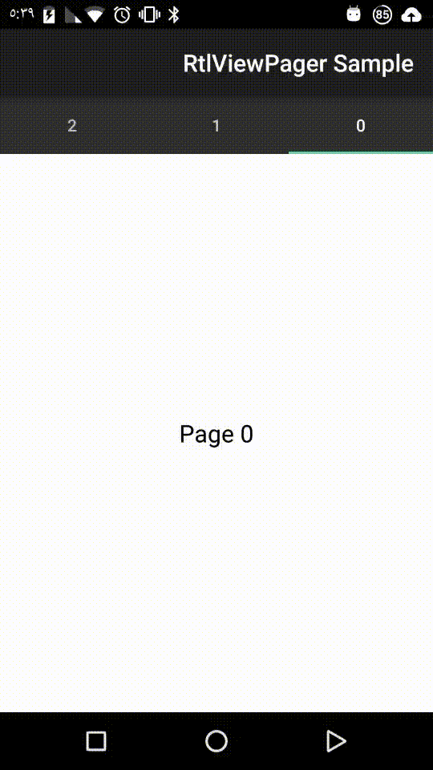

# RtlViewPager
ViewPager that displays items from right to left for RTL locales and behaves like a regular ViewPager otherwise

Motivation
-------------

Android is continuously improving support of different languages. It has been possible since almost the beginning to have different resources for different locales and text orientations. Concretely RTL has improved since offering a specific qualifier (-rtl) for RTL resources, Android 4.2 got support for automatic mirroring,  4.3 (and the support library) got a BidiFormatter and 4.4 can automatically mirror resources. However still it is not possible to use a ViewPager and say that it 'just works' for RTL languages, forcing their users to follow an unnatural left to right pattern.
 
Having a global market and focusing on the user means that as a developer you want to provide the best possible user experience for any user in simple way, and that was the main motivation for this component. The simple solution would have been following the norm and use the regular ViewPager, but sometimes you need to go beyond the norm to achieve the result that you expect.  

	

Usage
-------------
 
Import it using gradle

	dependencies {
		...
	    compile 'com.booking:rtlviewpager:1.0.1'
	}

And replace your ViewPager instances by RtlViewPager. RtlViewPager extends ViewPager so you can also use it for your custom ViewPager implementations.

	ViewPager viewPager = new RtlViewPager(context);
	
No further changes are needed.

Acknowledgment
-------------
This module was originally developed for Booking.com. With approval from Booking.com, this module was generalized and published on GitHub and jCenter.

License
-------------
> Copyright 2015 Diego Gómez Olvera

> Licensed under the Apache License, Version 2.0 (the "License");
you may not use this file except in compliance with the License.
You may obtain a copy of the License at

>   http://www.apache.org/licenses/LICENSE-2.0

>Unless required by applicable law or agreed to in writing, software
distributed under the License is distributed on an "AS IS" BASIS,
WITHOUT WARRANTIES OR CONDITIONS OF ANY KIND, either express or implied.
See the License for the specific language governing permissions and
limitations under the License.
